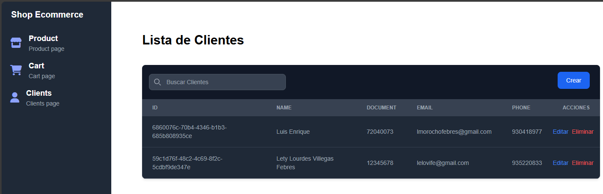
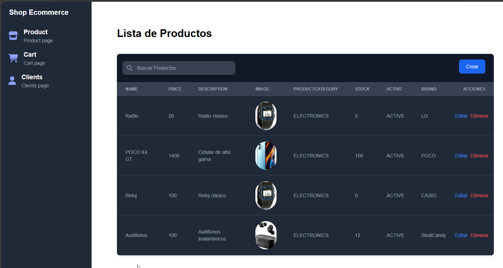
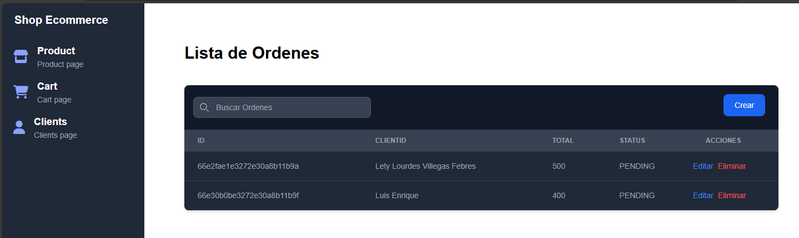
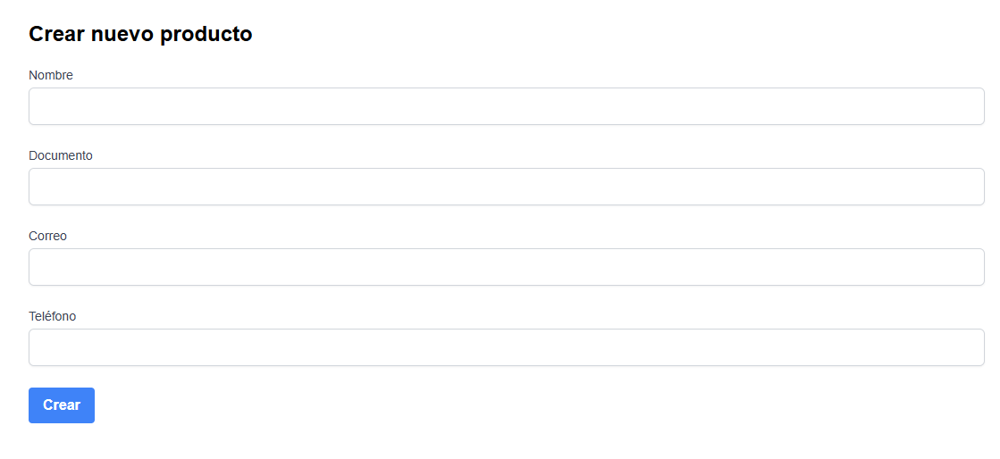
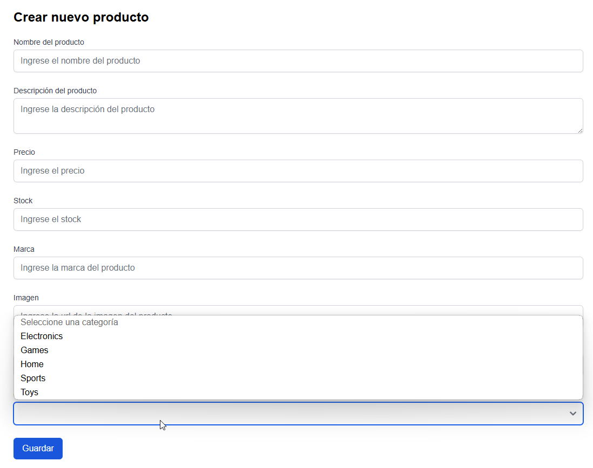
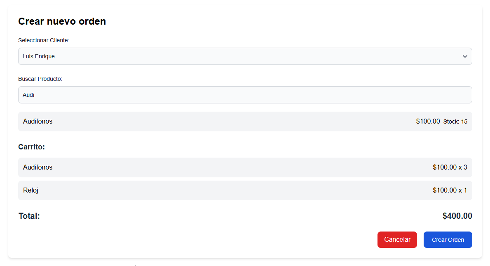

# ShopEcommerce

This project was generated with [Angular CLI](https://github.com/angular/angular-cli) version 18.2.3.

## Development server

Run `ng serve` for a dev server. Navigate to `http://localhost:4200/`. The application will automatically reload if you change any of the source files.

## Build

Run `ng build` to build the project. The build artifacts will be stored in the `dist/` directory.

## Captures

### Lista de Clientes

### Lista de Productos

### Lista de Ordenes

### Crear Cliente

### Crear Producto

### Crear Orden

